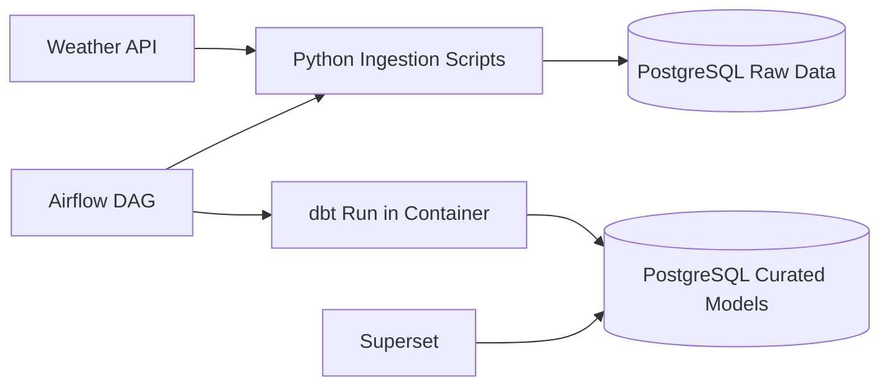

# Weather Data Engineering Learning Project

An end-to-end analytics learning project that ingests weather data, transforms it with dbt, orchestrates workflows in Airflow, and exposes curated outputs in Apache Superset, all running locally with Docker Compose.

## Project Goal

Build and operate a realistic local data platform that mirrors common production patterns:
1. Data ingestion with Python.
2. Storage in PostgreSQL.
3. Transformations with dbt.
4. Orchestration with Airflow.
5. Visualization and exploration with Superset.

## Architecture



## Tech Stack

- Docker Compose
- PostgreSQL
- Apache Airflow 3
- dbt (Postgres)
- Apache Superset
- Python

## Repository Structure

- `airflow/`: DAGs and Airflow secrets
- `api-request/`: API ingestion and load scripts
- `dbt/`: dbt project, models, profiles, and outputs
- `docker/`: Superset configuration and bootstrap helpers
- `postgres/`: SQL initialization scripts and local DB data mount
- `docker-compose.yaml`: multi-service local orchestration

## Run Locally

1. Start services:
```bash
docker compose up -d
```

2. Access applications:
- Airflow: http://localhost:8000
- Superset: http://localhost:8088

3. Trigger the pipeline from Airflow UI and validate transformed tables in dbt/Superset.

## What I Learned

This project was especially valuable for understanding platform integration in practice.

1. I learned a lot about configuration and Docker setup, and how much configuration is needed to make multiple tools work together correctly.
2. It was valuable to learn that Docker is a great tool for development and testing different applications in isolated, reproducible environments.
3. I improved my ability to troubleshoot real-world issues involving service networking, startup order, authentication, and environment management.
4. I gained hands-on experience connecting orchestration, transformation, and BI layers into one cohesive workflow.

## Portfolio Impact

Use these points in a resume or interview summary:

1. Built a containerized, end-to-end analytics workflow using Airflow, dbt, PostgreSQL, and Superset.
2. Implemented orchestration for ingestion plus transformations with repeatable local runs through Docker Compose.
3. Diagnosed and fixed cross-service issues including Docker network resolution, authentication flow errors, and startup dependency sequencing.
4. Standardized environment-based configuration for reproducibility and cleaner local development setup.
5. Delivered a working BI layer connected to transformed warehouse models for dashboard-ready analytics.

## Key Challenges Solved

1. Resolved container networking mismatches between orchestrator tasks and Compose-managed networks.
2. Stabilized Airflow authentication for local development by configuring deterministic SimpleAuthManager credentials.
3. Corrected Superset initialization and app-context integration to ensure metadata setup and database registration complete successfully.
4. Consolidated configuration into local environment files to reduce hardcoded secrets and improve maintainability.

## Tutorial Credit

This project was built as a hands-on learning exercise by following a YouTube tutorial by Calvin Yoon:

- Calvin Yoon tutorial: https://www.youtube.com/watch?v=vMgFadPxOLk

## Screenshots

Suggested screenshots to include for portfolio presentation:

1. Airflow DAG graph and successful run.
2. dbt model lineage or run output.
3. Superset database connection setup.
4. Superset chart or dashboard built from curated weather data.

Recommended folder structure:

- `screenshots/airflow/`
- `screenshots/dbt/`
- `screenshots/superset/`

Suggested naming convention:

- `01_airflow_dag_graph.png`
- `02_dbt_lineage.png`
- `03_superset_db_connection.png`
- `04_superset_dashboard.png`

Quick screenshot tips:

1. Keep browser zoom at 100% for consistency.
2. Use the same window size for all captures.
3. Capture successful states (green runs, valid connections, populated charts).
4. Crop lightly so key UI elements stay visible.

## Future Enhancements

1. Add automated tests for ingestion and dbt transformations.
2. Add CI checks for SQL quality and model health.
3. Version control Superset dashboard artifacts.
4. Introduce separate Compose overlays for dev and production-like setups.
